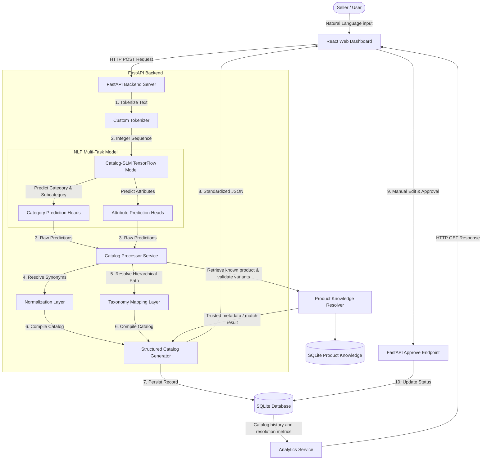

# System Architecture

The Catalog-SLM system consists of a Vite-based React frontend dashboard, a FastAPI backend, an SQLite database for catalog history, and a TensorFlow-based multi-task NLP pipeline.

## System Block Diagram

## Architectural Components

1. **Presentation Layer (React + Vite + Tailwind CSS)**:
   - Dashboard: High-level analytics on processed items and success rate.
   - Catalog Generator: Primary workspace for inputting product descriptions, seeing step-by-step processing state, and correcting/approving the output.
   - History: Table interface for managing previous catalogs (Draft, Approved, Needs Review).
   - Taxonomy Browser: A browseable tree showing the active ONDC taxonomy.
   - Evaluation: Displays the ML metrics generated during training.

2. **Inference & Service Layer (FastAPI)**:
   - Orchestrates requests, manages database state, and serves taxonomy configurations.
   - Houses the `CatalogProcessor` which encapsulates tokenizer, model execution, normalization synonyms, taxonomy mapping, and existing-product resolution.

3. **Data Layer (SQLite)**:
   - Lightweight relational database to persist catalogs, resolution outcomes, processing times, confidence logs, and seller decisions.
   - A product knowledge table stores trusted product metadata and valid variants. The catalog processor retrieves this data before finalizing catalog details; approved new products can be added to the same table.
